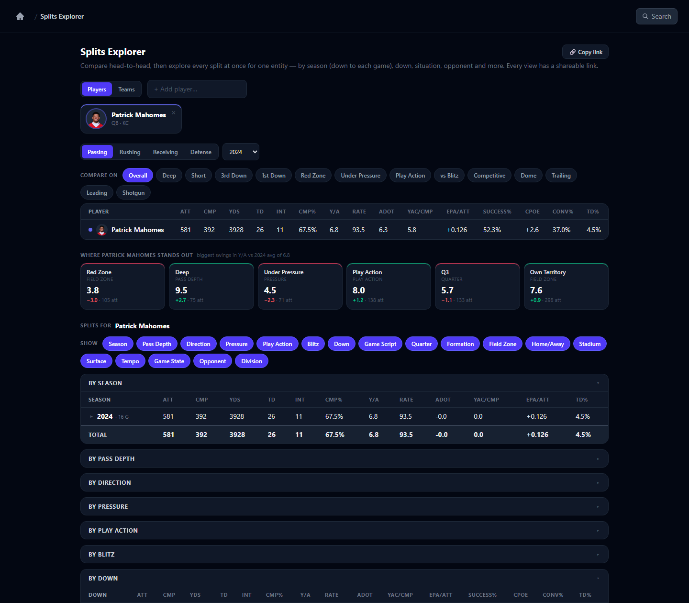
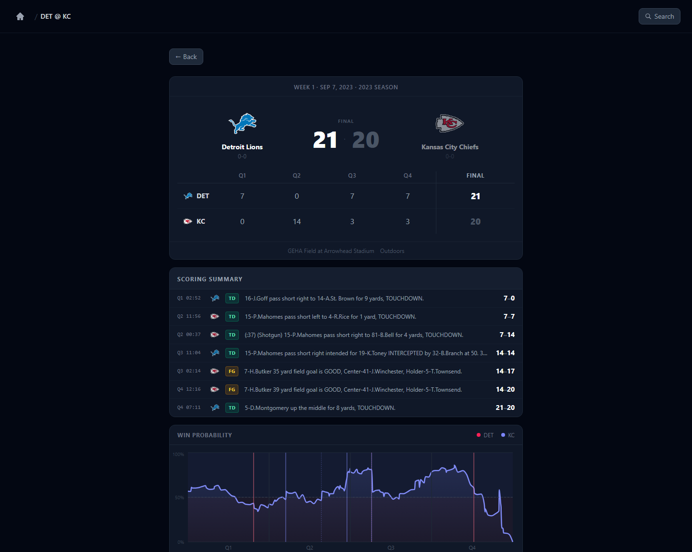
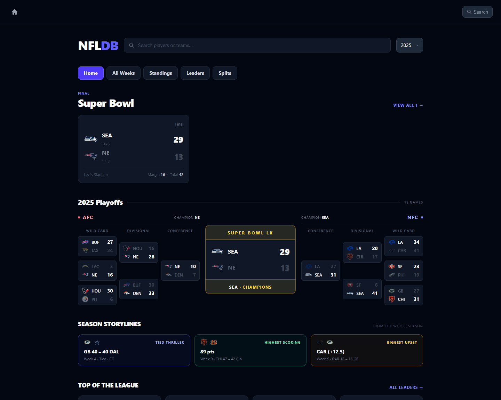

# NFLDB — NFL Analytics & Situational Splits

A full-stack NFL analytics platform built on nflfastR play-by-play. The
centerpiece is a **situational splits engine** that conditions any player's or
team's full stat line on one dimension at a time — pass depth, pressure,
play-action, game state, opponent, and 15+ more — for **offense *and* defense**.
Every derived number is verified to reconcile with official NFL stats.

**[Deployment guide →](./DEPLOY.md)** &nbsp;·&nbsp; one-container deploy to Cloud Run (free tier)



---

## Why it's different

Most public stats sites show you a stat line. This shows you the *story behind it*.

- **A situational splits engine.** Compare players or teams head-to-head, then
  break any one of them down across **18 dimensions at once** — down, pass
  depth, pressure (clean vs hit), play-action, blitz, red zone, dome,
  *competitive-snaps-only*, vs each opponent, and more — with an auto-surfaced
  "where they stand out" panel. Works for offense and defense, players and teams.
- **Accuracy verified to the play.** The play-by-play–derived splits reconcile
  **exactly** with official weekly stats (0 mismatches on attempts / carries /
  targets, league-wide), enforced by automated reconciliation tests that gate
  every deploy.
- **Engineered for speed.** gzip (payloads 10–20× smaller), HTTP caching,
  point-lookup indexes, per-request cursors for lock-free concurrent reads, and
  a pruned columnar store.

| Game page — box score, scoring summary, win probability | Home — playoff bracket, storylines, leaders |
|---|---|
|  |  |

---

## Engineering highlights

These are the parts I'm most proud of — and the ones worth a closer look.

### Data accuracy you can trust
- Official `weekly_player_stats` is the source of truth for counting stats; the
  situational splits are computed from raw play-by-play yet **reconcile to it
  exactly**. Getting there meant matching the NFL's own definitions — e.g. a
  pass attempt is a completion/incompletion/interception (not nflfastR's
  `pass_attempt`, which counts sacks in some seasons), and carries *include* QB
  kneels.
- **EPA is standardized across every page.** I reverse-engineered nflfastR's
  weekly `passing_epa` (it's `SUM(qb_epa)` over dropbacks) so "EPA/att" means
  the identical number on the Splits, Leaders, and Player pages.
- [`api/tests/test_reconciliation.py`](api/tests/test_reconciliation.py) enforces
  all of this against the real database, and the **deploy is gated on it passing
  inside the shipped image** — a release is blocked if the data doesn't reconcile.

### Performance
- Responses **gzip ~10–20×** (a veteran's splits payload: 570KB → 46KB) — the
  dominant transfer cost.
- **HTTP caching**: completed seasons are immutable → cached a week; live data → 5 min.
- **ART point-lookup indexes** on the large per-request tables, and per-request
  DuckDB cursors (MVCC-isolated) so concurrent reads never serialize on a lock.
- **Pruned the play-by-play store from 396 → 169 columns**, cutting the database
  **872MB → 400MB** with zero loss of functionality (every builder + query
  re-verified against the slim schema).

### The splits engine
- **Long-format materialized tables** (`player_splits`, `defense_splits`,
  `team_splits`): one row per `(entity, season, category, dimension, value)`, so
  "overall" always reconciles with the sum of its splits — one source of truth.
- **Single-dimension by design** — no combinatorial explosion of cross-products.
- **FTN charting** (play-action, blitz, defenders-in-box) joined to the
  play-by-play for 2022+; **defensive splits** built by unioning 20 per-defender
  credit columns into an events stream.

### Full-stack, typed end-to-end
- FastAPI + Pydantic → **OpenAPI → `openapi-typescript` codegen** → a fully typed
  React/TypeScript client. A schema change flows to the frontend types
  automatically; no hand-written, drift-prone interfaces.

---

## Stack

| Layer | Tech |
|---|---|
| Backend | Python, FastAPI, Pydantic, DuckDB |
| Data | `nfl_data_py` / nflfastR (play-by-play, weekly stats, NGS, FTN charting, snaps, rosters) |
| Frontend | React, TypeScript, Vite, Tailwind CSS, Recharts |
| Tests / CI | pytest (incl. data-reconciliation invariants), GitHub Actions |
| Deploy | Docker, Google Cloud Run |

## Architecture

```
nfl_data_py ─► DuckDB (raw play-by-play, ~169 cols)
                    │
                    ├─► materialize ─► player_splits · defense_splits · team_splits
                    │                  player_game_stats · team_season_analytics · comparables
                    ▼
              FastAPI  (gzip · Cache-Control · per-request cursors)   ── /api/*
                    │
              OpenAPI ─► openapi-typescript ─► typed React/TS client  ── /
```

One embedded DuckDB file, one process. Concurrency is handled *inside* the
process (independent cursors per request); the DB is single-writer, so the app
runs as a single worker — see the note under [Setup](#setup).

## Project structure

```
nfl-platform/
├── Dockerfile, DEPLOY.md          # one-container deploy → Cloud Run
├── api/
│   ├── main.py                    # FastAPI app: /api routes + serves the SPA
│   ├── ingest.py                  # data pipeline (pbp → materialized tables)
│   ├── splits_core.py             # shared situational-dimension scaffolding
│   ├── splits_builder.py          # player_splits (passing/rushing/receiving)
│   ├── def_splits_builder.py      # defense_splits (event-based)
│   ├── team_splits_builder.py     # team_splits (offense/defense rate profile)
│   ├── routers/                   # schedule, players, teams, leaders, meta
│   ├── tests/                     # endpoints, invariants, data-reconciliation
│   └── data/nfl.duckdb            # the database (gitignored; ~400MB)
└── frontend/src/
    ├── pages/SplitsPage.tsx       # the splits explorer
    ├── pages/                     # Schedule, Game, Player, Team, Leaders, Standings
    ├── splits.ts                  # split metrics / dimensions config
    └── api.ts, types/             # typed client (codegen from OpenAPI)
```

## Setup

**Backend**
```bash
cd api
python -m venv venv && venv\Scripts\activate     # Windows
pip install -r requirements.txt
uvicorn main:app --reload                         # :8000 (API under /api)
```

**Frontend**
```bash
cd frontend
npm install
npm run dev                                        # :5173 (proxies /api → :8000)
```

On first boot the API auto-loads recent seasons (a few minutes each, downloads
play-by-play). For a full historical build, run the ingest for the seasons you want.

> **Run a single process.** DuckDB is an embedded, single-writer database, so the
> API runs as one worker — concurrency is handled inside the process (each request
> gets its own cursor; reads run in parallel). Don't run multiple workers
> (`--workers N`, `gunicorn -w N`) or a second server against the same file.

## Tests

```bash
cd api && pytest
```

Covers endpoint behavior, data-quality **invariants**, and
**data-reconciliation** against the real database (splits ⇄ official stats, EPA
consistency, defensive-sack reconciliation). The reconciliation suite skips
cleanly when the DB isn't present (CI) and runs against the baked DB at deploy time.

## Deploy

The whole app ships as one container (frontend + API + database). See
**[DEPLOY.md](./DEPLOY.md)** — fast local build, or the GitHub Actions → Cloud Run
pipeline (free tier).

## Data notes

- **Coverage:** 1999–2025, regular season + playoffs.
- **NGS** (CPOE, time-to-throw, separation) from 2016; **FTN charting**
  (play-action, blitz, box count) from 2022; **snap counts** from ~2012.
- **Known limitation:** a handful of *rushing/receiving yard totals* differ by
  1–3 yards in the pbp-derived views — nflfastR credits lateral/multi-player
  yardage differently than the official scorer. Counts are always exact; this is
  bounded and tested. Defensive *coverage* data (completion % allowed) isn't in
  nflfastR, so defensive splits are event-based (tackles / pressure / takeaways).
